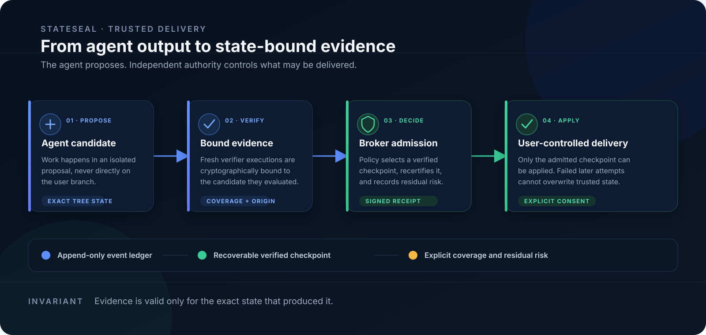
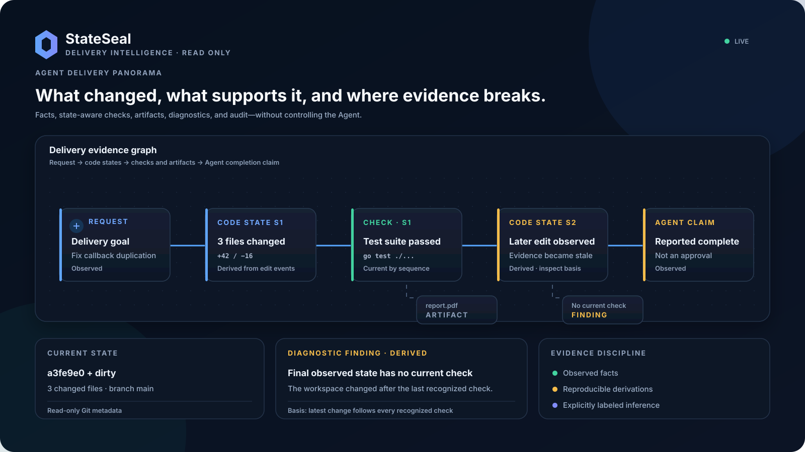

# StateSeal

[English](README.md) · [简体中文](README.zh-CN.md) · [日本語](README.ja.md) ·
[한국어](README.ko.md) · [Español](README.es.md) ·
[Português do Brasil](README.pt-BR.md) · **Deutsch** · [Français](README.fr.md)

StateSeal verwandelt Kandidaten von Coding Agents in Ergebnisse, die an den
exakten Codezustand gebunden, unabhängig verifiziert, wiederherstellbar,
rezertifizierbar und auditierbar sind. Verifikationsumfang und Restrisiken
werden ausdrücklich ausgewiesen.

> Das Modell schlägt vor. Nachweise informieren. Der Broker entscheidet. Git erinnert. Der Benutzer wendet an.

StateSeal ist weder ein weiterer Coding Agent noch ein Ersatz für Tests. Es
umschließt den vorhandenen Agenten und die Prüfkommandos, damit ausgelieferter
und verifizierter Code exakt übereinstimmen.



## Kernfunktionen

| Funktion | Nutzen |
| --- | --- |
| Bindung an den exakten Zustand | Ordnet jedes Prüfergebnis genau dem erzeugenden Codebaum zu |
| Unabhängige Verifikation | Führt Richtlinien in einem sauberen Evaluator ohne Agent-Selbstauskunft aus |
| Checkpoint-Wiederherstellung | Bewahrt den letzten vertrauenswürdigen Zustand trotz späterer Regression |
| Externe Zulassung | Der Broker entscheidet anhand von Nachweisen, Abdeckung und Richtlinie |
| Auditierbare Belege | Dokumentiert Herkunft, Nachweisquelle und Restrisiko |

## Warum

Ein lang laufender Agent kann Tests bestehen, weiter editieren, eine Regression
einführen und trotzdem Erfolg melden. StateSeal macht Kandidaten, Nachweise,
Prüfpunkte, Rezertifizierung und Zulassung zu expliziten Protokollzuständen.

```text
WORKING → CANDIDATE → VERIFYING → VERIFIED → RECERTIFYING → ADMITTED
                           ↘ REJECTED                 ↘ STALE / ABSTAINED
```

## Schnellstart

```bash
go install github.com/hellogxp/stateseal/cmd/seal@latest
cd your-project
seal integrate codex-desktop
seal run "Doppelte Callbacks beheben und Kompatibilität erhalten"
seal ui
```

Die Runs Console zeigt repositoryübergreifende Läufe, den Herkunfts-DAG,
Prüfnachweise, die vertrauenswürdige Zeitleiste, Wiederherstellung und Belege.
Die UI ist schreibgeschützt und lauscht nur auf Loopback-Adressen.



## Integrationen und Automatisierung

StateSeal integriert Codex Desktop, Codex CLI, Claude Code und Qoder. Andere
Terminal-Agents nutzen dasselbe Protokoll über `seal run -- <command>`.
JSON-Ausgabe, stabile Regel-IDs und Abschlussbelege unterstützen CI und
reproduzierbare Forschung.

## Vertrauensgrenze

`ADMITTED` bedeutet nur, dass der exakte Prüfpunkt die Richtlinie in `seal.yaml`
erfüllt hat. Es beweist weder die Vollständigkeit von Spezifikation oder Tests
noch die Integrität des Hosts.

## Dokumentation

- [Deutsche Dokumentation](docs/de/index.md)
- [Erste Schritte](docs/de/getting-started.md)
- [Runs Console](docs/de/runs-console.md)
- [Englische technische Referenz](docs/index.md)

Protokollwerte, Befehle, Digests und Logs bleiben zur Wahrung der Auditsemantik
im englischen Original.
