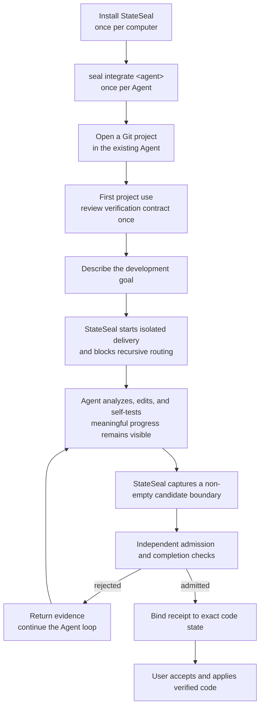
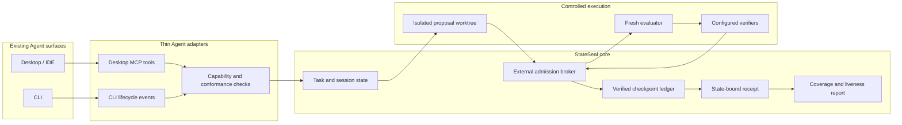

# StateSeal product map

StateSeal turns a coding Agent's candidate into a state-bound, independently
verified, recoverable, recertifiable, and auditable delivery result—with
explicit verification coverage and residual risk. It is neither an Agent nor
a test framework, and it does not ship a separate Desktop application.

## User experience



The portable authoritative path starts the controlled task with `seal run`.
Codex Desktop uses MCP to route an ordinary code-changing prompt into that same
path; read-only work remains outside the delivery state machine. Server-initiated
native confirmation gates the one-time project contract and final apply. MCP
routing remains Agent-mediated, while all boundaries after `start_delivery` are
enforced by StateSeal. No prompt prefix or hook-trust command is required. The
surface remains experimental until the repaired path passes pinned live Desktop
conformance. Other Desktop/IDE adapters currently provide the lifecycle
foundation only.

## Product architecture



## Responsibility boundary

| Layer | Owns | Does not own |
| --- | --- | --- |
| User | Goal, verification-contract approval, final apply | Running every check manually |
| Agent | Analysis, implementation, self-testing, repair loop | Final admission verdict |
| Adapter | Native MCP/lifecycle translation and feedback | Verification policy or authority |
| StateSeal core | State identity, admission, checkpoint, recertification, receipt | Writing product code |
| Verifier | Executable evidence for configured checks | Specification completeness |
| Git | Reproducible trees and delivery transaction | Verifier independence or host trust |

## Verification depth

```text
L0  StateSeal integrity       exact state · policy · freshness · receipt
L1  Project engineering      test · build · lint · type · static analysis
L2  Domain acceptance        business invariants · private acceptance suites
L3  Protected authority      remote CI · protected runner · deployment · human
```

Automatic discovery proposes a minimum L1 contract. It does not infer L2/L3
acceptance and does not claim specification completeness. Receipts record each
verifier's layer, origin, evidence and status, plus declared uncovered risks.

## Delivery status

| Capability | Status |
| --- | --- |
| Goal-driven managed CLI | Implemented and live-validated with pinned Codex CLI |
| Project verification discovery and one-time confirmation | Implemented |
| Isolated proposal and fresh evaluator | Implemented |
| Admission, checkpoint recovery, completion recertification | Implemented |
| Hash-chained ledger and state-bound receipt | Implemented |
| Verification coverage, provenance and delivery-impact reporting | Implemented; product outcome baselines pending |
| User-level Codex/Claude/Qoder integration management | Implemented; Desktop/IDE level remains experimental |
| Qoder project adapter | Deterministic contract tests implemented; live validation pending |
| Codex Desktop managed delivery | Recursive child and empty-candidate failure injections pass; native confirmation and exact-branch binding implemented; pinned live rerun pending |
| Claude Code, Qoder, Cursor live compatibility | Pending pinned-version validation |
| StateSeal Desktop application | Explicitly out of scope |
| Cloud dashboard and multi-Agent orchestration | Deferred |

## Maintained roadmap

| Priority | Outcome | Exit evidence |
| --- | --- | --- |
| P0 | Reliable core and honest result model | Go race tests, 35-case SealBench, receipt-schema compatibility |
| P0 | Portable CLI experience | one goal command, useful progress, one final apply decision, stack fixtures |
| P0 | Desktop delivery integrity | no recursive routing, no empty admission, native enable/apply confirmation, truthful branch state, pinned live run |
| P1 | Mainstream Agent conformance | pinned live CLI/Desktop evidence with downgrade on capability loss |
| P1 | L2/L3 verifier integration | domain profiles, protected CI/runner evidence and explicit authority |
| P1 | Product outcome evaluation | false-reject, abstention, useful-delivery and overhead baselines |
| Deferred | Separate Desktop App, cloud dashboard, multi-Agent orchestration | reconsider only after core demand and evidence |

## Trust statement

`ADMITTED` means the exact checkpoint passed the listed checks in a fresh local
evaluator and still matched the evidence at delivery. It does not prove that
the checks are complete, the host is uncompromised, or remote CI passed. Those
coverage limits and residual risks remain explicit in every receipt. See the
[verification model](verification-model.md) and [research evidence boundary](research-evidence.md).
