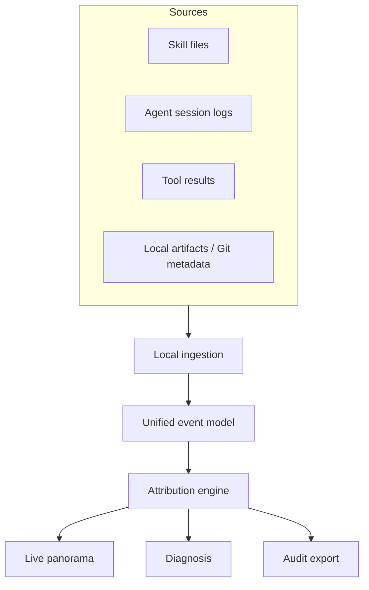

# Product map

## Positioning

StateSeal is the runtime intelligence plane between fragmented Agent telemetry
and developer understanding. It is not an Agent gateway or delivery gate.

## Modules

| Module | Responsibility | Product boundary |
| --- | --- | --- |
| Source adapters | Read Agent-owned files | Never write Agent configuration |
| Normalizer | Convert versioned schemas | Preserve source and confidence |
| Attribution | Correlate Skill, tool, artifact, and outcome | Label inference explicitly |
| Panorama | Session list, DAG, timeline | Read-only GET APIs |
| Diagnostics | Surface failure clusters and missing signals | Advice only |
| Audit export | Produce portable summaries | No delivery authority |

## Roadmap

1. Harden Codex transcript compatibility and incremental indexing.
2. Add Claude Code and OpenCode read-only adapters.
3. Add artifact/file-change correlation and privacy controls.
4. Add latency, failure, Skill adoption, and value dashboards.
5. Add portable OpenTelemetry-style export without proxying Agent traffic.

Managed Agent execution, blocking, admission, and Apply are explicitly outside
the roadmap.
