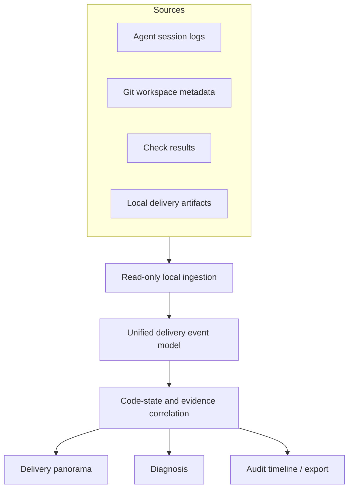

# Product map

## Positioning

StateSeal is a local delivery-intelligence plane between fragmented Agent
telemetry and developer understanding. It is not an Agent gateway, runner, or
delivery gate.

## Core modules

| Module | Responsibility | Product boundary |
| --- | --- | --- |
| Source adapters | Read Agent-owned logs and local metadata | Never install or write Agent configuration |
| Normalizer | Convert versioned sources to stable delivery events | Preserve source and uncertainty |
| State correlator | Relate edits, checks, artifacts, and completion claims | Never claim unobserved causality |
| Evidence engine | Compute current, failed, stale, gap, or unknown posture | Not a semantic-correctness oracle |
| Diagnostics | Explain failures and missing evidence with a reproducible basis | Advice and audit only |
| Panorama | Search, graph, findings, checks, artifacts, timeline | GET-only local APIs |

## Product principles

1. **Outcome first, tools second.** Developers see delivery state before tool noise.
2. **State-aware evidence.** A check result belongs to the code state it evaluated.
3. **Facts before inference.** Every statement carries an evidence grade and basis.
4. **Zero intervention.** No hook, proxy, Agent launcher, approval, block, or writeback.
5. **Local and privacy-first.** Sanitize before display; export only on explicit user action.

## Roadmap

1. Harden Codex compatibility and incremental indexing.
2. Add read-only Claude Code and OpenCode adapters.
3. Correlate standard test reports, SARIF, coverage, and CI run URLs.
4. Add cross-session trends: repeated failure areas, stale-evidence rate, verification latency.
5. Add portable JSON/SARIF/OpenTelemetry-style exports without proxying model traffic.

Intervention, delivery authority, policy enforcement, and Agent orchestration are
explicitly outside the roadmap.
