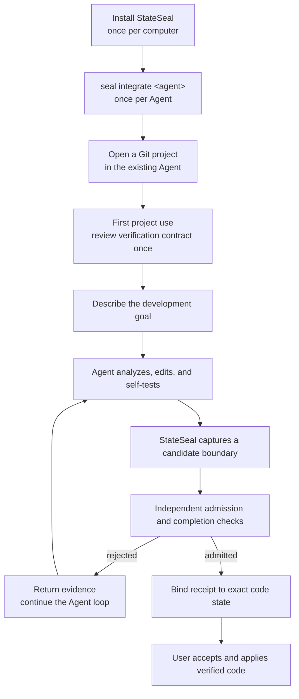
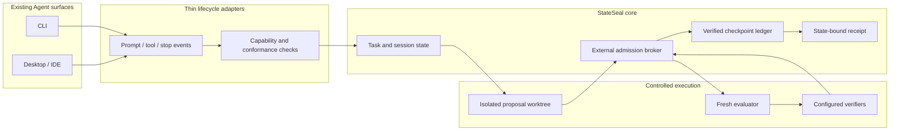

# StateSeal product map

StateSeal turns a coding Agent's candidate into a state-bound, independently
verified, recoverable, and auditable delivery result. It is neither an Agent
nor a test framework, and it does not ship a separate Desktop application.

## User experience

The portable authoritative path starts the controlled task with `seal run`.
Codex Desktop now delegates `StateSeal: <goal>` into that same authoritative
path while retaining confirmation in the original conversation. It remains
experimental until pinned live Desktop conformance. Other Desktop/IDE adapters
currently provide the lifecycle foundation only.

## Product architecture

## Responsibility boundary

| Layer | Owns | Does not own |
| --- | --- | --- |
| User | Goal, verification-contract approval, final apply | Running every check manually |
| Agent | Analysis, implementation, self-testing, repair loop | Final admission verdict |
| Adapter | Native lifecycle translation and feedback | Verification policy or authority |
| StateSeal core | State identity, admission, checkpoint, recertification, receipt | Writing product code |
| Verifier | Executable evidence for configured checks | Specification completeness |
| Git | Reproducible trees and delivery transaction | Verifier independence or host trust |

## Delivery status

| Capability | Status |
| --- | --- |
| Goal-driven managed CLI | Implemented and live-validated with pinned Codex CLI |
| Project verification discovery and one-time confirmation | Implemented |
| Isolated proposal and fresh evaluator | Implemented |
| Admission, checkpoint recovery, completion recertification | Implemented |
| Hash-chained ledger and state-bound receipt | Implemented |
| User-level Codex/Claude/Qoder integration management | Implemented; Desktop/IDE level remains experimental |
| Qoder project adapter | Deterministic contract tests implemented; live validation pending |
| Codex Desktop managed delivery | Deterministic end-to-end path implemented; pinned live Desktop conformance pending |
| Claude Code, Qoder, Cursor live compatibility | Pending pinned-version validation |
| StateSeal Desktop application | Explicitly out of scope |
| Cloud dashboard and multi-Agent orchestration | Deferred |

## Trust statement

`ADMITTED` means the exact checkpoint passed the configured checks in a fresh
local evaluator and still matched the evidence at delivery. It does not prove
that the checks are complete, the host is uncompromised, or remote CI passed.
Those residual risks remain explicit in every receipt.
