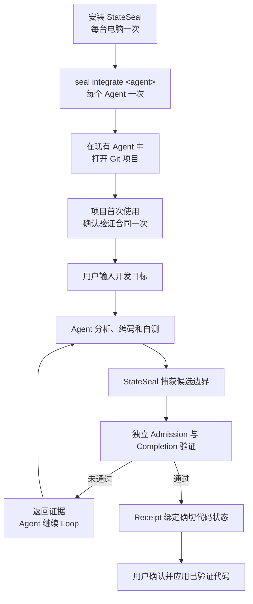
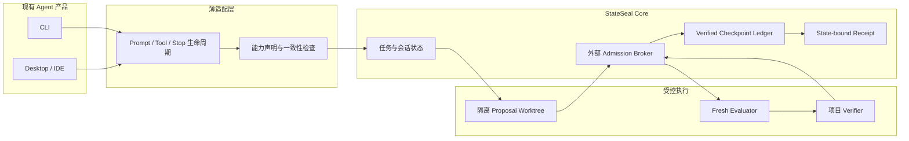

# StateSeal 产品全景

StateSeal 将 Agent 生成的候选代码转换成与确切状态绑定、经过外部独立验证、
可以恢复、复验和审计的交付结果。它不是 Agent、不是测试框架，也不开发独立
Desktop App。

## 用户完整流程

当前权威路径由 `seal run` 启动。用户级 Desktop/IDE 生命周期集成已经具备
安装、检查和卸载能力，但完整 Desktop 受控交付仍标记为 experimental。

## 技术架构

## 当前能力状态

| 能力 | 状态 |
| --- | --- |
| 目标驱动的受控 CLI | 已实现；固定 Codex CLI 版本已通过实机验证 |
| 项目识别与首次验证合同确认 | 已实现 |
| 隔离候选区与 Fresh Evaluator | 已实现 |
| Admission、checkpoint 恢复、completion recertification | 已实现 |
| Hash-chain ledger 与 state-bound receipt | 已实现 |
| Codex、Claude、Qoder 用户级集成管理 | 已实现；Desktop/IDE 仍为 experimental |
| Qoder 项目 adapter | 已通过确定性合同测试；等待实机验证 |
| Codex Desktop 完整受控交付 | 进行中：仍需会话/工作区绑定和实机 conformance |
| Claude、Qoder、Cursor 实机兼容矩阵 | 待完成 |
| StateSeal Desktop App | 明确不做 |
| 云 Dashboard、多 Agent 编排 | 暂缓 |

`ADMITTED` 表示确切 checkpoint 在全新本地 Evaluator 中通过了配置检查，并且
交付状态仍与证据一致。它不证明测试完整、主机未被攻破或远程 CI 已通过。
