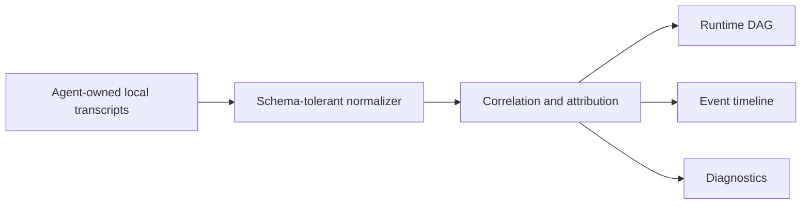

# Runtime panorama

`seal ui` is a read-only projection of supported local Agent sessions.

## Questions it answers

| Question | Surface |
| --- | --- |
| What is running or needs attention? | Searchable session list |
| Which Skill was actually loaded? | Derived Skill attribution nodes |
| Which tools ran, and in what order? | Runtime DAG and event timeline |
| Which tool reported failure? | Attention status and tool node |
| Is a statement fact or analysis? | Observed / Derived / Inferred label |

## Data flow

There is no arrow back to the Agent. StateSeal does not install hooks, proxy
requests, write prompts, or call execution-control APIs.

## Status semantics

- **ACTIVE**: no terminal session event has been observed.
- **COMPLETED**: the Agent emitted a completion event.
- **ATTENTION**: the session completed but one or more tool results reported a
  failure pattern.

These are observational states, not delivery decisions.

## Security

- GET-only local APIs;
- loopback listener only;
- restrictive browser security headers;
- raw arguments are hidden by default;
- source schemas are parsed defensively;
- no mutation, approval, apply, restore, or Agent-control endpoint.
