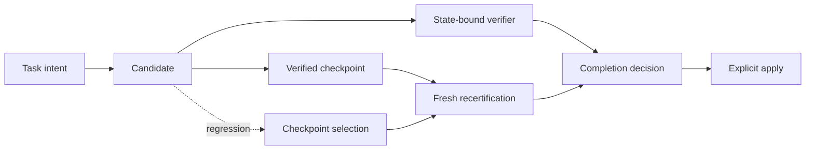

# Runs console


`seal ui` is StateSeal's local observability surface. It turns external
authority state into an operational view without creating a second source of
truth.

## What it answers

The overview is organized around questions a developer needs during and after
an agent run:

| Question | Surface |
| --- | --- |
| What is running, admitted, blocked, or applied? | Searchable and filterable Runs list |
| Which candidate produced each result? | State-provenance DAG |
| Which exact code state did a verifier evaluate? | Evidence inspector |
| Was an earlier checkpoint recovered? | Forward-only recovery and recertification path |
| Why was delivery allowed or blocked? | Receipt verdict, rule, disposition, and reason |
| Can the timeline be trusted? | Hash-chain validation before events reach the UI |

## Start it

```bash
seal ui
```

StateSeal selects an available loopback port, prints the URL, and opens the
default browser. Useful options:

```bash
seal ui --no-open
seal ui --address 127.0.0.1:9137
```

The command can run from any directory because it discovers authority state
across all local repositories.

## State provenance, not a decorative pipeline

The graph is projected from typed task state, verifier evidence, and the
integrity-checked event ledger:



Recovery never draws a backward-in-time edge. Selecting an older checkpoint
creates a new selection and recertification transition, preserving a directed
acyclic provenance graph.

Node color is always paired with a status label:

- blue: active work;
- green: verified, admitted, or applied;
- amber: stale, abstained, selected, or recovered;
- red: rejected, regressed, or failed.

Select a node to inspect its candidate, tree, checkpoint, evidence, rule, or
receipt identifiers. Verifier output is bounded before it reaches the browser
so a pathological command cannot make the console unresponsive.

The graph uses its actual edges to calculate topology. Empty semantic phases are
not reserved as blank columns, admission evidence is placed before the
checkpoint it certifies, and simple linear runs are centered in a compact
canvas. Long labels are clipped within their node; the complete value remains
available through the tooltip and inspector.

## Languages

The Runs Console supports English, Simplified Chinese, Japanese, Korean,
Spanish, Brazilian Portuguese, German, and French. It follows an explicit user
selection first, then the browser locale, and finally falls back to English.
Task goals, protocol values, IDs, digests, and verifier output remain in their
original form because they are audit data rather than interface copy.

## Live updates

The embedded server uses a server-sent event stream. It publishes a new
snapshot only when trusted local state changes; inactive consoles do not
re-render every polling interval. An interrupted stream reconnects
automatically.

## Security and authority

The console is intentionally read-only:

- there are no admit, apply, restore, or policy mutation endpoints;
- the listener accepts only `localhost` or loopback IP addresses;
- response headers disable framing, external scripts, external connections,
  and MIME sniffing;
- ledger events are omitted when their sequence or hash continuity fails, and
  the affected run is shown with an integrity warning;
- repository authority remains in the external platform state directory; the
  browser is only a projection.

Applying a checkpoint continues to require the existing CLI or native
integration confirmation path. Viewing a green node is never itself an
authorization decision.
