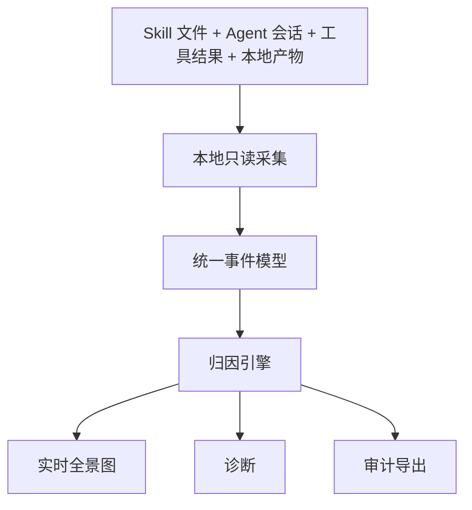

# 产品全景

StateSeal 位于碎片化 Agent 遥测和开发者理解之间，是运行时智能平面，不是 Agent
网关，也不是交付 Gate。

| 模块 | 职责 | 边界 |
| --- | --- | --- |
| 数据源适配器 | 读取 Agent 自有文件 | 不写 Agent 配置 |
| 标准化 | 兼容版本化格式 | 保留来源与可信度 |
| 归因 | 关联 Skill、工具、产物、结果 | 显式标注推断 |
| 全景图 | 会话、DAG、时间线 | 只读 GET API |
| 诊断 | 暴露失败与信号缺失 | 只给建议 |
| 审计导出 | 生成可交换摘要 | 不拥有交付权 |

路线图包括 Codex 增量索引、Claude Code/OpenCode 只读适配、产物关联、隐私控制、
效能看板和标准化导出。接管 Agent、阻断、准入和 Apply 明确不在路线图中。
