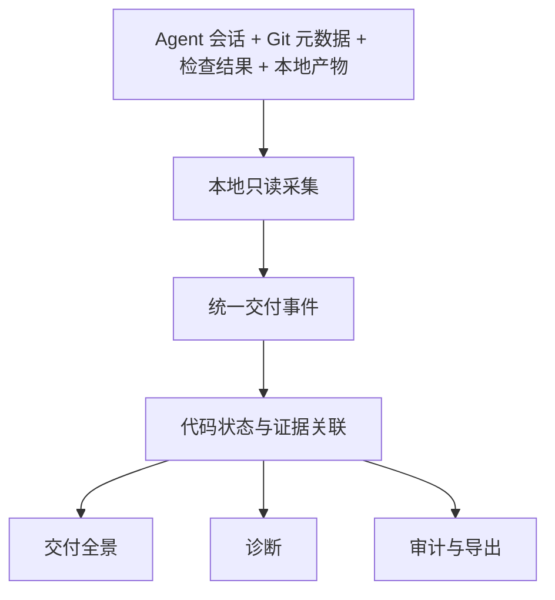

# 产品全景

StateSeal 是连接碎片化 Agent 遥测与开发者理解的本地交付智能层，不是 Agent 网关、
执行器或交付 Gate。

## 核心模块

| 模块 | 职责 | 产品边界 |
| --- | --- | --- |
| 来源适配器 | 读取 Agent 日志与本地元数据 | 绝不写 Agent 配置 |
| 标准化 | 转换版本化来源格式 | 保留来源与不确定性 |
| 状态关联 | 关联编辑、检查、产物与完成声明 | 不声称未观测因果 |
| 证据引擎 | 计算当前、失败、过期、缺口或未知 | 不是语义正确性 Oracle |
| 诊断 | 给出可复核依据 | 只提供信息和审计 |
| 全景 UI | 搜索、DAG、发现、检查、产物、时间线 | 只读 GET API |

## 产品原则

1. 结果优先，工具其次；
2. 检查结果必须属于它实际检查的代码状态；
3. 事实、派生与推断清晰分层；
4. 零介入：无 Hook、代理、Agent 启动、审批、阻断或写回；
5. 本地优先、隐私优先。

未来重点是更多只读 Agent 适配器、标准测试报告/SARIF/覆盖率关联、跨会话趋势和
显式导出。介入执行、策略执法和 Agent 编排不在路线图内。
