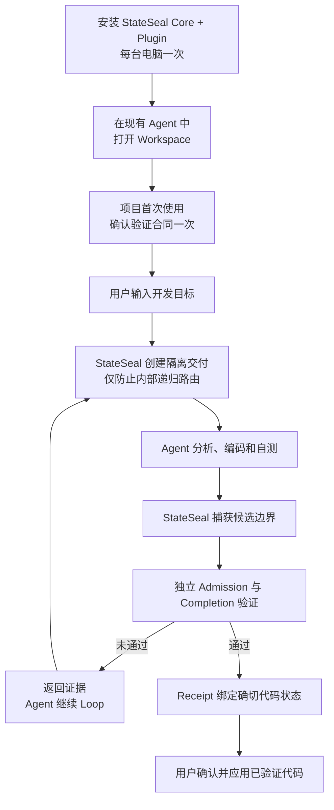
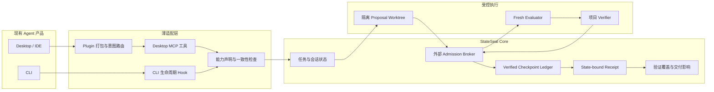

[English](../product-map.md) | 简体中文

# StateSeal 产品全景

StateSeal 将 Coding Agent 的候选代码转换为与确切状态绑定、经过独立验证、
可恢复、可复验、可审计，并明确披露验证覆盖与剩余风险的交付结果。它不是
Agent、不是测试框架，也不开发独立 Desktop App。

## 用户完整流程



通用权威路径仍由 `seal run` 启动。StateSeal Plugin 打包自动路由 Skill 与
MCP 注册，StateSeal Core 是事务 Broker。Codex Desktop 通过 MCP 自动识别普通开发
目标并委托给同一条权威路径；项目合同启用和最终应用各使用一次 Agent 原生工具授权
控制，不需要提示词前缀或 Hook 信任命令。内部递归保护只作用于 StateSeal
Worker，不会阻止用户继续开发；StateSeal 基础设施故障会可见降级为原生 Agent
流程并标记 `UNVERIFIED`，健康 enforce 策略的真实拒绝仍然有效。在固定 Desktop
版本完成实机 conformance 前仍标记为 experimental。其他 Desktop/IDE adapter
当前只完成生命周期基础。

## 技术架构



## 验证深度

```text
L0  StateSeal 完整性控制   状态 · 策略 · 新鲜度 · Checkpoint · Receipt
L1  项目工程检查          测试 · 构建 · Lint · 类型 · 静态分析
L2  领域验收              业务不变量 · 私有验收集
L3  受保护权威            远程 CI · 受保护 Runner · 部署环境 · 人工审批
```

自动发现只生成最低限度的 L1 建议，不能推断完整需求，也不能替代 L2/L3。
Receipt 会记录每个 Verifier 的层级、来源、Evidence 和结果，同时披露未覆盖项。

## 当前能力状态

| 能力 | 状态 |
| --- | --- |
| Codex Plugin（Skill + MCP + marketplace） | 已实现；Plugin 官方验证器通过 |
| 非 Git Workspace 仓库发现和显式选择 | 已实现 |
| StateSeal 自身故障结构化降级 | 已实现；结果标记 `UNVERIFIED`，不生成 Receipt |
| 目标驱动的受控 CLI | 已实现；固定 Codex CLI 版本已通过实机验证 |
| 项目识别与首次验证合同确认 | 已实现 |
| 隔离候选区与 Fresh Evaluator | 已实现 |
| Admission、checkpoint 恢复、completion recertification | 已实现 |
| Hash-chain ledger 与 state-bound receipt | 已实现 |
| 验证覆盖、来源与交付影响报告 | 已实现；产品结果基线待完成 |
| Codex、Claude、Qoder 用户级集成管理 | 已实现；Desktop/IDE 仍为 experimental |
| Qoder 项目 adapter | 已通过确定性合同测试；等待实机验证 |
| Codex Desktop 完整受控交付 | MCP 握手、策略授权、精确 receipt 应用的确定性端到端链路已通过；等待固定 Desktop 版本实机 conformance |
| Claude、Qoder、Cursor 实机兼容矩阵 | 待完成 |
| StateSeal Desktop App | 明确不做 |
| 云 Dashboard、多 Agent 编排 | 暂缓 |

## 持续维护路线图

| 优先级 | 目标 | 验收证据 |
| --- | --- | --- |
| P0 | 核心可靠与诚实结果模型 | Go race、35 个 SealBench case、Receipt Schema 兼容 |
| P0 | 简洁可靠的 CLI | 一个目标命令、有用进度、一次交付确认、多技术栈 fixture |
| P1 | 主流 Agent 一致性 | 固定版本 CLI/Desktop 实机证据，能力退化时自动降级 |
| P1 | L2/L3 Verifier | 领域 Profile、受保护 CI/Runner Evidence 与明确 Authority |
| P1 | 产品效果评估 | 误拒、弃权、有效交付率与额外开销基线 |
| 暂缓 | 独立 Desktop App、云 Dashboard、多 Agent 编排 | 核心需求和证据成熟后再评估 |

`ADMITTED` 表示确切 Checkpoint 在全新本地 Evaluator 中通过了列出的检查，
并且交付状态仍与 Evidence 一致。它不证明测试完整、主机未被攻破或远程 CI
已通过；这些验证边界和剩余风险必须继续出现在 Receipt 中。
