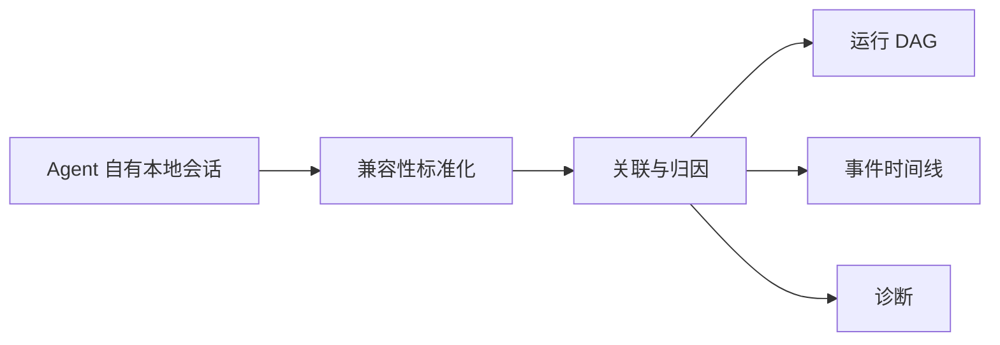

# 运行全景图

`seal ui` 是受支持本地 Agent 会话的只读投影。

| 问题 | 展示 |
| --- | --- |
| 哪些会话正在运行或需要关注？ | 可搜索会话列表 |
| 哪个 Skill 被真正加载？ | 派生 Skill 归因节点 |
| 工具按什么顺序执行？ | 运行 DAG 和事件时间线 |
| 哪个工具报告失败？ | 需关注状态和工具节点 |
| 一条结论是事实还是分析？ | Observed / Derived / Inferred |

链路没有返回 Agent 的箭头。StateSeal 不安装 Hook、不代理请求、不写 Prompt，也不
调用执行控制 API。

- **ACTIVE**：尚未观测到会话结束；
- **COMPLETED**：Agent 发出完成事件；
- **ATTENTION**：会话完成，但至少一个工具结果报告失败模式。

这些都是观测状态，不是交付决策。
