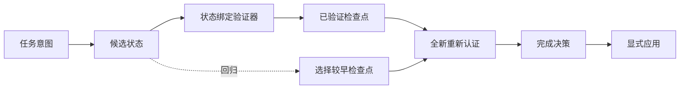

# Runs Console

[English](../runs-console.md) | 简体中文

`seal ui` 是 StateSeal 的本地可观测界面。它把外部权威状态投影为可以操作性理解的
视图，但不会创建第二套事实来源。

## 它回答什么问题

| 问题 | 界面 |
| --- | --- |
| 哪些任务正在运行、已准入、被阻止或已应用？ | 可搜索、可过滤的 Runs 列表 |
| 哪个候选状态产生了结果？ | 状态溯源 DAG |
| 验证器测试的是哪个精确代码状态？ | 验证证据检查器 |
| 是否恢复了较早的检查点？ | 只向前的恢复与重新认证路径 |
| 为什么允许或阻止交付？ | 凭证裁决、规则、处置和原因 |
| 时间线是否可信？ | 事件进入 UI 前验证哈希链 |

## 启动

```bash
seal ui
```

StateSeal 自动选择可用的回环端口、输出 URL 并打开浏览器：

```bash
seal ui --no-open
seal ui --address 127.0.0.1:9137
```

它可以从任意目录启动，因为 authority state 位于仓库外部，并可跨仓库发现。

## 状态溯源，而不是装饰性流水线



恢复不会画出逆时间方向的边。选择旧检查点会创建新的 selection 和
recertification 状态，因此整个溯源关系仍然是有向无环图。

节点文字在边界内裁剪，完整内容通过悬停提示和 Inspector 展示。简单线性 Run 会自动
压缩空层级；复杂分支才扩展画布。

## 多语言

Runs Console 支持 English、简体中文、日本語、한국어、Español、
Português do Brasil、Deutsch 和 Français。默认根据浏览器语言选择，也可从右上角
手动切换。Goal、协议值、ID、digest 和验证器日志保留原文。

## 安全与权威

- UI 没有准入、应用、恢复或策略写入 API；
- 监听地址只允许 `localhost` 或回环 IP；
- ledger 的序列或哈希连续性失败时，不会把不可信事件发送给浏览器；
- 验证器输出在进入浏览器前限制长度；
- 应用检查点仍然必须通过 CLI 或原生集成的确认路径。

查看绿色节点本身永远不构成授权。
